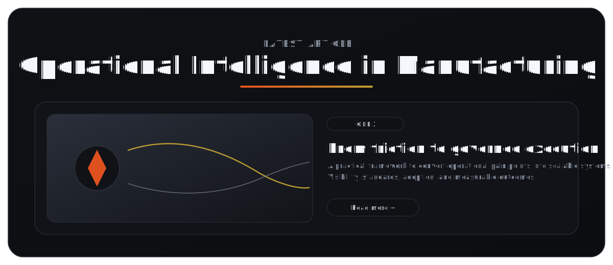

# README Components Template

Plantilla maestra para copiar/pegar componentes en tu `README.md` de GitHub Profile.

## 1. Headers and Text

```md
# Main Title
## Section Title
### Subsection Title

Normal paragraph text.
**Bold** / *Italic* / ~~Strikethrough~~

> This is a quote block.
```

## 2. Lists and Checklists

```md
- Bullet item
- Another item

1. Ordered item
2. Ordered item

- [x] Completed task
- [ ] Pending task
```

## 3. Links and Contact

```md
[Portfolio](https://example.com)
[LinkedIn](https://linkedin.com/in/your-user)
[Email](mailto:you@example.com)
```

## 4. Images (Local and Remote)

```md


```

```html


```

## 5. Clickable Image

```md
[](https://youtube.com/watch?v=xxxx)
```

## 6. Badges

```md


```

## 7. Code Blocks

```md
```bash
git add .
git commit -m "Update README"
git push
```
```

```md
```ts
type User = {
  name: string;
  role: string;
};
```
```

## 8. Markdown Table

```md
| Role | Company | Period |
|---|---|---|
| OPEX Technician II | Merit Medical | 2021 - 2025 |
| Maintenance Technician II | Merit Medical | 2020 - 2021 |
```

## 9. HTML Table Layout (2 Columns)

```html
<table>
  <tr>
    <td width="55%">
      <h3>Left Content</h3>
      <p>Text, bullets, links.</p>
    </td>
    <td width="45%">
      
    </td>
  </tr>
</table>
```

## 10. Collapsible Section

```html
<details>
  <summary><b>Open Section</b></summary>
  <br/>
  Hidden content here.
</details>
```

## 11. Spacing and Section Rhythm

```html
<table><tr><td height="28"></td></tr></table>
```

```html
<table width="100%">
  <tr>
    <td height="360" valign="middle" align="center">
      Section block content
    </td>
  </tr>
</table>
```

## 12. Skills Grid

```html
<p align="center">
  
</p>
```

## 13. GitHub Dynamic Cards

```html


```

## 14. Typing Animation

```html
<p align="center">
  
</p>
```

## 15. Header and Footer

```html
<p align="center">
  
</p>
```

```html
<p align="center">
  
</p>
```

## 16. Profile Section Skeleton

```md
# Hero
# About
# Skills
# Experience
# Projects
# Services
# Education
# Contact
```

## 17. Common Reusable Blocks

### 17.1 Experience Card

```html
<table>
  <tr>
    <td width="22%"><b>Company</b></td>
    <td width="53%"><b>Role</b><br/>- Impact bullet 1<br/>- Impact bullet 2</td>
    <td width="25%" align="right">Date Range</td>
  </tr>
</table>
```

### 17.2 Project Card

```html
<table width="100%">
  <tr>
    <td width="50%" valign="middle" align="center">
      
    </td>
    <td width="50%" valign="middle">
      <h3>Project Name</h3>
      <p>Problem solved and outcome.</p>
      <p><b>Stack:</b> Tech1, Tech2</p>
    </td>
  </tr>
</table>
```

## 18. Unsupported / Limited in README

```md
- No JavaScript execution
- No iframe embeds (YouTube player style)
- No native <video> player rendering
- Avoid heavy external dependencies for critical content
```

## 19. Practical Asset Structure

```txt
images/              # tracked (used by README.md)
  github-banner.gif
  icons-carousel.gif
  divider.gif
  archive/           # old variants (tracked)
  drafts/            # local experiments (ignored)

assets/              # local scratch (ignored)
```

## 20. Final Checklist Before Push

```md
- [ ] All links work
- [ ] Images load correctly
- [ ] Mobile and desktop preview checked
- [ ] Section spacing consistent
- [ ] No placeholder text left
```
